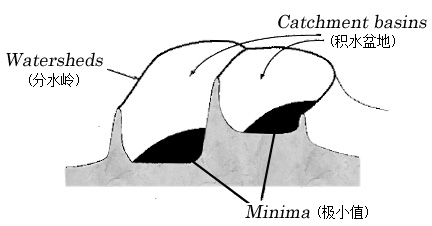
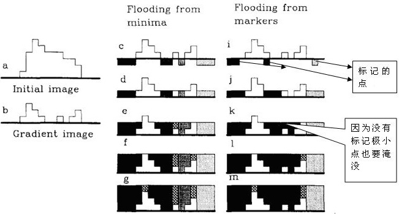
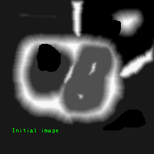

# watershead

## 传统分水岭

[paper](https://readpaper.com/paper/2124260943)

传统的分水岭分割方法，是一种基于拓扑理论的数学形态学的分割方法，其基本思想是把图像看作是测地学上的拓扑地貌，图像中每一像素的灰度值表示该点的海拔高度，每一个局部极小值及其影响区域称为集水盆地，而集水盆地的边界则形成分水岭。分水岭的概念和形成可以通过模拟浸入过程来说明。在每一个局部极小值表面，刺穿一个小孔，然后把整个模型慢慢浸人水中，随着浸入的加深，每一个局部极小值的影响域慢慢向外扩展，在两个集水盆汇合处构筑大坝如下图所示，即形成分水岭。

**然而基于梯度图像的直接分水岭算法容易导致图像的过分割，产生这一现象的原因主要是由于输入的图像存在过多的极小区域而产生许多小的集水盆地，从而导致分割后的图像不能将图像中有意义的区域表示出来。所以必须对分割结果的相似区域进行合并。**

## 改进分水岭

因为传统分水岭算法存在过分割的不足，OpenCV提供了一种改进的分水岭算法，使用一系列预定义标记来引导图像分割的定义方式。使用OpenCV的分水岭算法cv::wathershed，需要输入一个标记图像，图像的像素值为32位有符号正数（CV_32S类型），每个非零像素代表一个标签。它的原理是对图像中部分像素做标记，表明它的所属区域是已知的。分水岭算法可以根据这个初始标签确定其他像素所属的区域。传统的基于梯度的分水岭算法和改进后基于标记的分水岭算法示意图如下图所示。

为了解决过度分割的问题，可以使用基于标记(mark)图像的分水岭算法，就是通过先验知识，来指导分水岭算法，以便获得更好的图像分段效果。通常的mark图像，都是在某个区域定义了一些灰度层级，在这个区域的洪水淹没过程中，水平面都是从定义的高度开始的，这样可以避免一些很小的噪声极值区域的分割。

