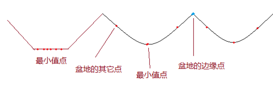

# 图像分割之分水岭算法

分水岭算法是一种图像区域分割法，在分割的过程中，它会把跟临近像素间的相似性作为重要的参考依据，从而将在空间位置上相近并且灰度值相近（求梯度）的像素点互相连接起来构成一个封闭的轮廓。**分水岭算法常用的操作步骤：彩色图像灰度化，然后再求梯度图，最后在梯度图的基础上进行分水岭算法，求得分段图像的边缘线。**

**对灰度图的地形学解释，我们我们考虑三类点：**

1. 局部最小值点，该点对应一个盆地的最低点，当我们在盆地里滴一滴水的时候，由于重力作用，水最终会汇聚到该点。注意：可能存在一个最小值面，该平面内的都是最小值点。

2. 盆地的其它位置点，该位置滴的水滴会汇聚到局部最小点。

3. 盆地的边缘点，是该盆地和其它盆地交接点，在该点滴一滴水，会等概率的流向任何一个盆地。
   
