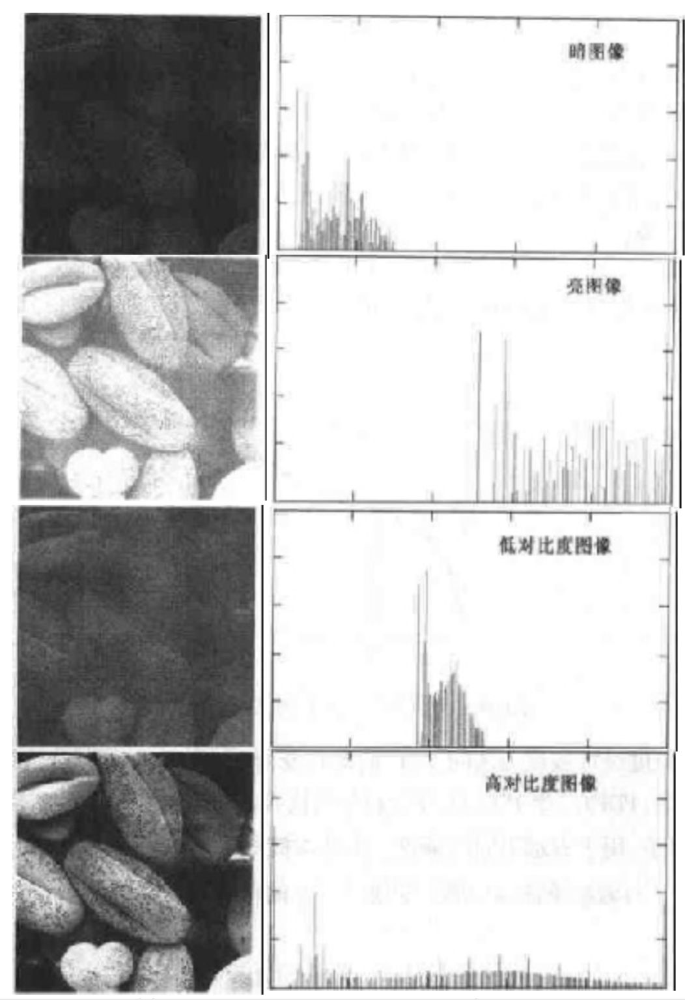
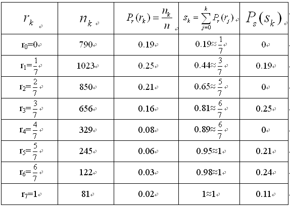

# 图像处理

## 一、图像处理的基础知识

！[知乎][]

---

### 图像直方图与像素距离

传感器获取的图像是平面上的连续函数，将连续函数采样(sampled)为 M 行 N 列的矩阵，将每个连续样本量化(quantization)为一个整数值，即图像函数的连续范围被分成了 K 个区间，采样后得到的矩阵构成了离散图像，栅格中无限小的采样点对应于数字图像中的像元，即像素(pixel) 。

灰度图像中，最低值对应黑，最高值对应白；黑白之间的亮度值是灰度阶(gray-level) ，彩色图像则通过矢量函数（三阶张量）描述，可以将一幅彩色图像看做由 R,G,B 三种基础色进行堆叠形成，而这三种基础色又对应了三个大小相同的矩阵，矩阵的数值表征这一通道颜色的深浅。有时除了考虑 RGB 三种颜色外，还考虑像素的透明度 a，称为 RGBA 描述。

色彩在人类视觉感知中极其重要，色彩与物体反射不同波长的电磁波的能力相关，一般将这三种颜色（三种不同波长的光）作为三原色：红(700nm)、绿(546.1nm)、蓝(438.5nm)，灰度图像的矩阵元素数值与彩色图像间满足 Y=0.299R+0.587G+0.114B；RGB 数字图像中，以(0,0,0)表示黑色，(255,255,255)表示白色；灰度图像中，以 0 表示黑色，以 255 表示白色；二值图像中，以 0 表示黑色，1 表示白色。

图像每个位置[i,j]必定对应一个[0,255]的数值，统计每个数值所对应的像素点个数可以得到图像的亮度直方图，直方图（亮度直方图，brightness histogram）给出了图像中各个亮度值出现的概率，一幅 k 阶图像的直方图由具有 k 个元素的一维数组表示。

---

### 直方图均衡化
[知乎链接](https://zhuanlan.zhihu.com/p/32857009)

> **创建一幅在整个亮度范围内具有相同亮度分布的图像**，输入直方图 H[p]，输入亮度范围为[p0,pk]，直方图均衡化的目标是找到一个单调的像素亮度变换 q=T(p)，使输出直方图 G[q]在整个输出亮度范围[q0,qk]内是均匀的；增强了靠近直方图极大值附近的亮度的对比度，减小了极小值附近的对比度。在对图像做进一步处理之前，直方图均衡化通常是对图像灰度值进行归一化的一个非常好的方法，并且可以增强图像的对比度，原先图像灰色区域的细节变得清晰。

图像直方图函数：$$ h(r*{k}) = n*{k}\ ,k = 0,1,2....,L-1 $$

> 其中 $r_{k}$表示的是第 k 级灰度
> $n_{k}$表示灰度级中第 k 级对应的像素个数

归一化直方图函数：$$ h(r_{k}) = \frac{n_{k}}{n} \quad ,k = 0,1,2....,L-1 $$

可以得到$\sum_{k=0}^{L-1}P(r_{k}) = 1$



**当图像的直方图尽可能覆盖全部可能灰度级且分布均匀，则有高对比度和多变的灰度色调**

数学理解：

均衡化方法中，使用直方图的累积分布函数作为变换公式：

$$
S_{k} = T(r_{k}) = \displaystyle \sum_{j=0}^kP_{r}(r_{j})
$$

其中，$\displaystyle P_{r}(r_{j}) = \frac{n_{k}}{N}$

实际上就是**用某灰度级的累积概率来代替其原出现概率**，得到映射后新的灰度值（累积概率乘以最大灰度值）。


例如：

$r_{k}$代表原图的八个灰度级；$n_{k}$代表每个灰度级出现的频数；$P(r_{k})$代表每个灰度级出现的概率；$S_{k}$代表累积概率；$P_{s}$代表新图中rk所对应的出现概率。

---

### 图像阈值化与二值图像处理

Def.[图像二值化（阈值化）] 设输入图像为f，输出为g，则
$$g(m,n)=
\begin{cases}
1 & f(m,n)<t \\ 0 & f(m,n) \ge t
\end{cases}
$$

其中t称为阈值（thresh）。一种最优阈值选择算法，通过不断迭代直至收敛的方法，寻找一个最优的阈值。

另一种选择方法，**Otsu方法**，选择使得类间方差最大的值作为阈值，设图像的归一化直方图为p，亮度阶为k（例如元素值取0~255，则k=256），常用于基于图像分割的聚类。
理论依据为：假定图像包含两类像素（前景像素和背景像素），直方图为双峰直方图，然后计算使得两类像素能分开的最佳阈值（类内方差），或等价的间类间方差最大。

对于图像 I(x,y)，前景(即目标)和背景的分割阈值记作 T，属于前景的像素点数占整幅图像的比例记为 ω0，平均灰度为 μ0；背景像素点数占整幅图像的比例为 ω1，平均灰度为 μ1；整幅图像的平均灰度记为μ，类间方差记为g。
假设图像大小为M×N，图像中像素的灰度值小于阈值 T 的像素个数为 N0，像素灰度大于阈值T的像素个数为 N1，那么：

$$\begin{cases}
\omega0 = N0/M*N  \\
\omega1 = N1/M*N \\
N0 +N1 = M*N \\
\omega+\omega = 1 \\
\mu=\omega0*\mu0+\omega1*\mu1 \\
g = \omega0*(\mu0-\mu)^2 + \omega1*(\mu1-\mu)^2\\
g = \omega0*\omega1*(\mu0-\mu1)^2
\end{cases}
$$

采用遍历的方法使得类间方差g最大的阈值T，即为所求。Ostu方法可以形象地理解为：求取直方图有两个峰值的图像中那两个峰值之间的低谷值 T 。

**matlab实现**（matlab中有现成的函数实现，函数名为： graythresh，该函数便是用Ostu方法求分割阈值Ｔ。）：

```matlab
imgScr=imread('..');
T = graythresh(imgScr);
BW = im2bw(imgScr,T);
```


