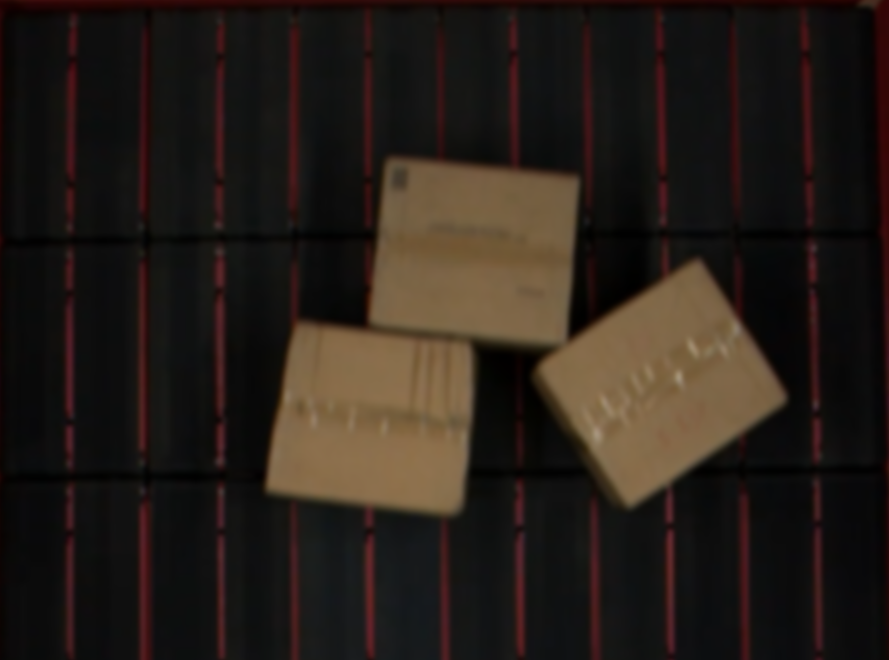
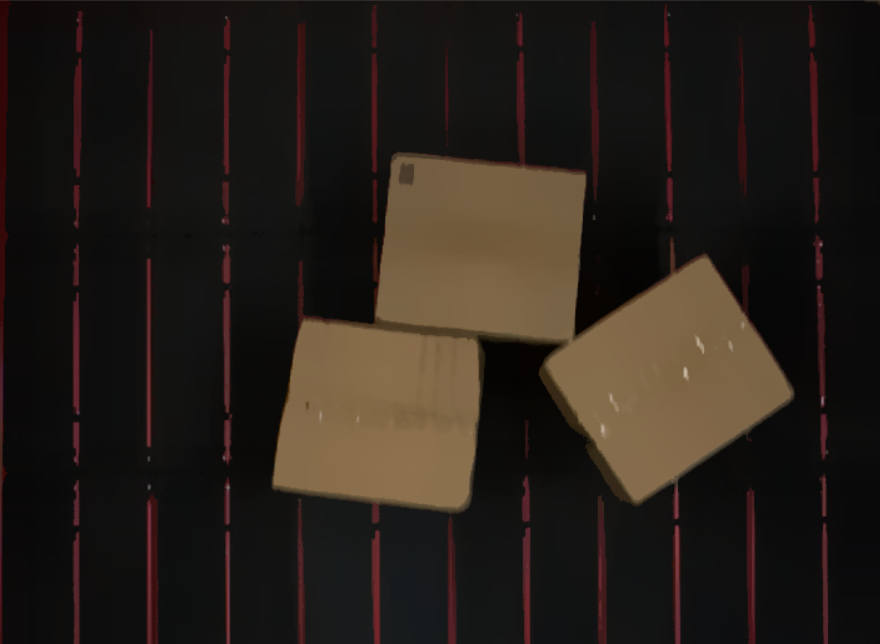
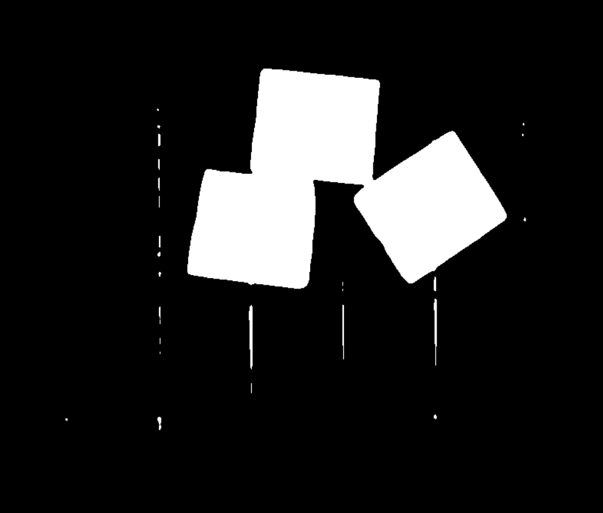
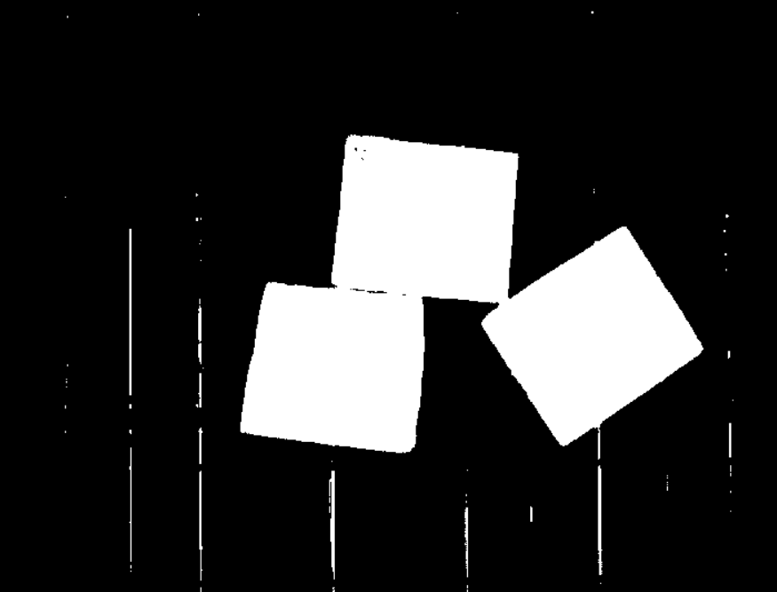

## 实现粘连分割的大概流程

一、图片读取

二、**边缘保留滤波** 将灰度值相近的元素进行聚类，将颜色数据差距不大的像素点合成一个颜色，方便后续处理

*why?*高斯模糊只考虑了权重，只考虑了像素空间的分布，没有考虑像素值和另一个像素值之间差异的问题，如果像素间差异较大的情况下（比如图像的边缘），高斯模糊会进行处理，但是我们不需要处理边缘，要进行的操作就叫做边缘保留滤波（EPF）
边缘保留滤波有两种方法，一种为高斯双边滤波，一种为均值迁移滤波法。

高斯模糊后图片：

使用均值迁移滤波后的图片：

可观察出图像的边缘信息被显著保留，而非边缘信大部分被过滤，这将有利于接下来的处理。

三、使用OSTU算法进行二值化

未进行滤波的二值化处理：

进行边缘保留滤波后的二值化：

**可看未进行滤波的二值化图片边缘粘连区域众多，这将对后续分割造成极大困难，即使进行距离变换也会将两个物品之间认为是一个像素中心，分水岭使无法在两个物体间形成分水岭。而进行边缘保留滤波后，两物体之间的部分空隙被保留并识别，这将有利于后续分水岭的形成。**

四、对二值图像进行距离变换

