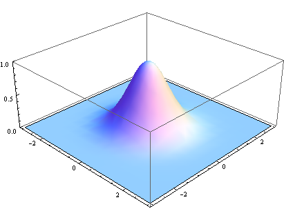
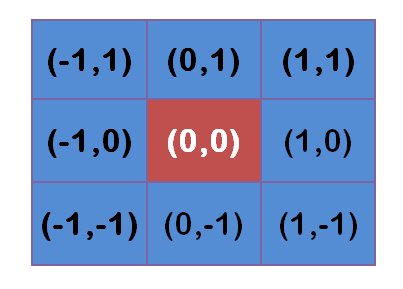
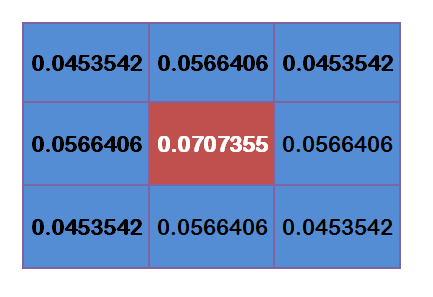
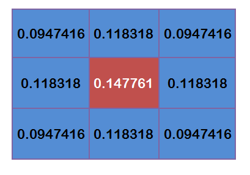

## 高斯平滑

*What* 所谓模糊可以理解为每一个像素都取周边像素的平均值。模糊半径越大图像就越模糊。
一种权重分配模式就是正太分布，而图像是二维的，所以需要二维的正态分布正态分布的密度函数叫做"高斯函数"（Gaussian function）。其中，μ是x的均值，σ是x的方差。因为计算平均值的时候，中心点就是原点，所以μ等于0。根据一维高斯函数，可以推导得到二维高斯函数：
$$
G(x,y) = \frac{1}{2\pi\sigma^2}e^{-(x^2+y^2)/2\sigma^2}
$$
有了这个函数 ，就可以计算每个点的权重了。

**权重矩阵**
假定中心点的坐标是（0,0），那么距离它最近的8个点的坐标如下：

更远的点以此类推。
为了计算权重矩阵，需要设定σ的值。假定σ=1.5，则模糊半径为1的权重矩阵如下：

这9个点的权重总和等于0.4787147，如果只计算这9个点的加权平均，还必须让它们的权重之和等于1，因此上面9个值还要分别除以0.4787147，得到最终的权重矩阵。
